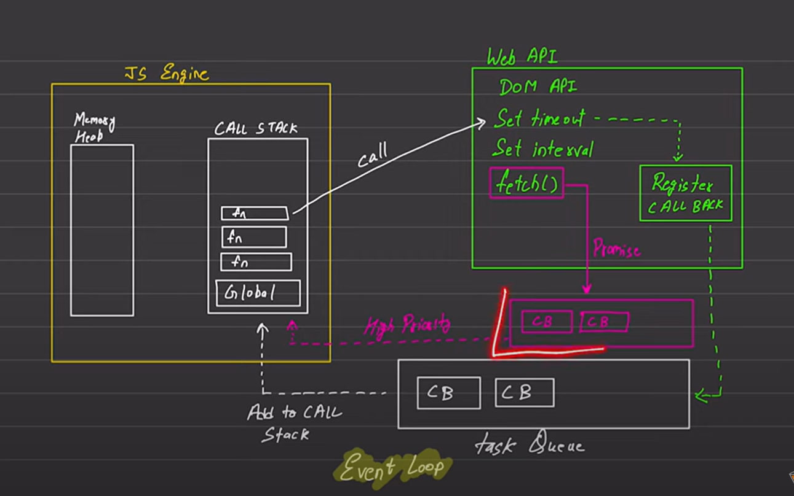

## 📌 **JavaScript Basics: Sync & Single-Threaded**

JavaScript is:

* **Synchronous**: Executes code **line by line**, one at a time.
* **Single-threaded**: It has **one call stack**. This means it can handle **one task at a time**.

So, if one function takes time (like accessing the network or waiting), the rest of the code **waits** — unless we use **asynchronous methods**.

---

## ⚙️ **Execution Context**

Every time JS runs code, it creates an **execution context**:

* Stored in the **Call Stack**
* Includes:

  * Variable environment (Memory)
  * Scope chain
  * `this` binding

---

## 🚧 Blocking vs Non-Blocking

| **Blocking Code**                    | **Non-Blocking Code**                    |
| ------------------------------------ | ---------------------------------------- |
| Executes fully before moving on      | Delegates tasks and continues            |
| Can freeze the browser               | Efficient and responsive                 |
| Example: long loops, large data sync | Example: `setTimeout`, `fetch`, promises |

---

## 🧠 Async JS Core Components

To handle non-blocking behavior, JavaScript relies on:

1. **JS Engine (Call Stack & Memory Heap)**
2. **Web APIs** (e.g., `setTimeout`, `fetch`, DOM APIs)
3. **Callback / Task Queue**
4. **Microtask Queue** (Promise Callbacks)
5. **Event Loop**

---

## 🔁 Event Loop Working Explained

Below is the **custom version of your uploaded diagram** recreated and explained:

---

### 🔷 Diagram Explanation (Modeled on your uploaded image)


---

### 🟨 **JS Engine (Left Section)**

* Contains two main components:

  * **Memory Heap**: For allocating memory to variables and objects.
  * **Call Stack**: Tracks function calls in a **Last-In-First-Out (LIFO)** manner.
* When a function is invoked, it is **pushed onto the call stack**.
* When it finishes execution, it is **popped off the stack**.

---

### 🟩 **Web API (Top Right Section)**

* Part of the browser, **not** the JS engine itself.
* Handles asynchronous APIs like:

  * `setTimeout()`
  * `setInterval()`
  * `fetch()`
  * DOM events
* When such a function is called:

  * It's sent to the Web API environment.
  * The **callback is registered** to execute **later**.

---

### 🔁 **Callback Registration**

* After timeout or event completion:

  * **Callback function is registered** to be executed.
  * If it’s a promise, it's sent to the **microtask queue**.
  * Else, it goes to the **task queue** (macro task).

---

### 📥 **Microtask Queue (Top Lower Right - Highlighted Pink)**

* Special queue for **promise callbacks** (e.g., `.then`, `.catch`, `.finally`).
* **Higher priority** than the task queue.
* Event loop always **empties the microtask queue first** before moving to task queue.

---

### 📦 **Task Queue (Bottom Right Section)**

* Also called **macro task queue**.
* Stores callback functions from:

  * `setTimeout`
  * `setInterval`
  * DOM events
* These are picked **after** the call stack is empty and microtasks are processed.

---

### 🔄 **Event Loop (Center Bottom – Yellow Text)**

* Constantly checks:

  1. **Is the call stack empty?**
  2. If yes, then:

     * Check and **run microtasks** first.
     * Then run **one task** from the task queue.
* Repeats indefinitely – manages the entire asynchronous execution.

---

### 📤 **Execution Flow**

* Function call → goes to **call stack**
* If async, control passed to **Web API**
* Web API **registers callback**
* Callback → moved to appropriate **queue**
* Event loop picks callback from queue → **adds to call stack**
* Callback executes and is removed from the call stack


---

## 🧪 Example in Practice

```javascript
console.log("Start");

setTimeout(() => {
  console.log("Timeout Callback");
}, 0);

Promise.resolve().then(() => {
  console.log("Promise Callback");
});

console.log("End");
```

### Output:

```
Start
End
Promise Callback
Timeout Callback
```

### Why?

1. `Start` prints (sync)
2. `setTimeout()` → goes to Web API → callback queued (task queue)
3. `Promise.then()` → callback goes to microtask queue
4. `End` prints
5. Microtask queue executes first → `Promise Callback`
6. Task queue executes → `Timeout Callback`

---

## ✅ Summary Points

* JS is synchronous and single-threaded by default.
* Blocking code can freeze execution.
* Async code uses:

  * Web APIs
  * Callbacks
  * Promises
  * Event loop
* Event loop gives priority to **microtask queue** over task queue.

---