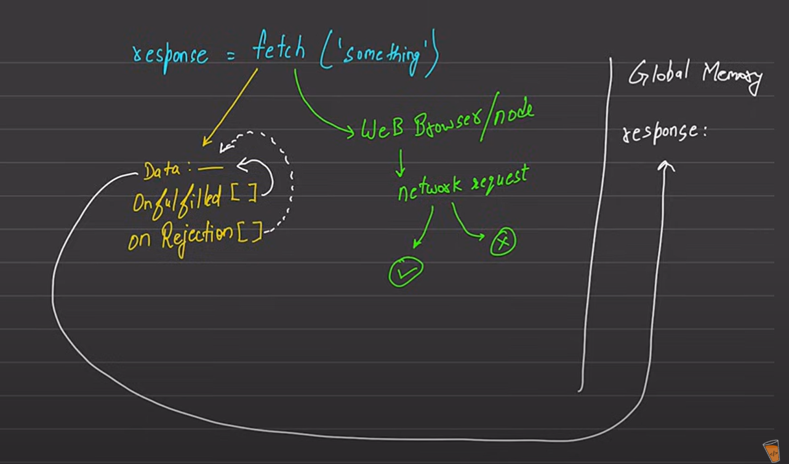

**Understanding the Fetch API in JavaScript**

---

### Overview:

The Fetch API is a modern interface that allows you to make HTTP requests in JavaScript. It provides a more powerful and flexible feature set than older technologies like XMLHttpRequest. Fetch is promise-based, making it easier to work with asynchronous code and chain multiple operations together.

---

### Syntax:

```javascript
fetch(url, options)
  .then(response => {
    // handle the response object
  })
  .catch(error => {
    // handle any error
  });
```

#### Parameters:

- **url**: The URL to which the request is sent.
- **options** *(optional)*: An object containing custom settings such as method, headers, body, mode, etc.

#### Common `options`:

```javascript
{
  method: 'GET' | 'POST' | 'PUT' | 'DELETE',
  headers: {
    'Content-Type': 'application/json'
  },
  body: JSON.stringify(data),
}
```

---

### Internal Working (Explained via Image):

The image illustrates the internal working of the `fetch` function and how JavaScript handles asynchronous operations using Promises.

---

---

1. **Initiating Fetch:**

   ```js
   const response = fetch('something');
   ```

   This line starts a network request to the URL "something".

2. **Global Memory:**

   - `response` is stored in global memory.
   - But it doesn't hold the actual result yet; it holds a `Promise` object.

3. **Web APIs / Node APIs:**

   - The call is sent to the Web Browser or Node environment which handles the actual network request asynchronously.

4. **Promise Lifecycle:**

   - Once the request is sent, JavaScript sets up two empty arrays (as shown in yellow in the image):
     - `onFulfilled[]`: to store the callback functions if the promise is resolved successfully.
     - `onRejection[]`: to store the callback functions if the promise fails.

5. **Response Handling:**

   - If the network request is successful (✅), the `onFulfilled` callbacks are triggered with the data.
   - If it fails (❌), the `onRejection` callbacks are triggered with the error.

6. **Thenable Object:**

   - The response behaves like a thenable object that waits for either fulfillment or rejection.
   - This behavior is critical in chaining `.then()` and `.catch()`.

---

### Example:

```javascript
fetch('https://api.example.com/data', {
  method: 'GET',
})
  .then(response => response.json())
  .then(data => console.log(data))
  .catch(error => console.error('Error:', error));
```

---

### Conclusion:

The Fetch API simplifies network requests and embraces JavaScript's promise-based asynchronous programming model. It enhances readability and maintainability of code and is the preferred method in modern JavaScript for making HTTP requests.

